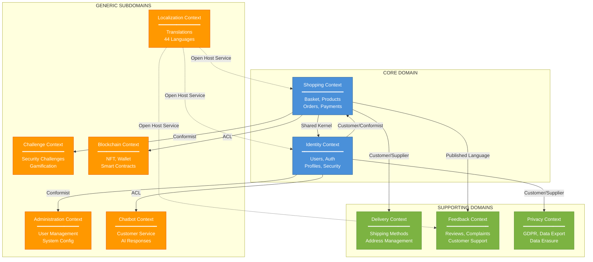
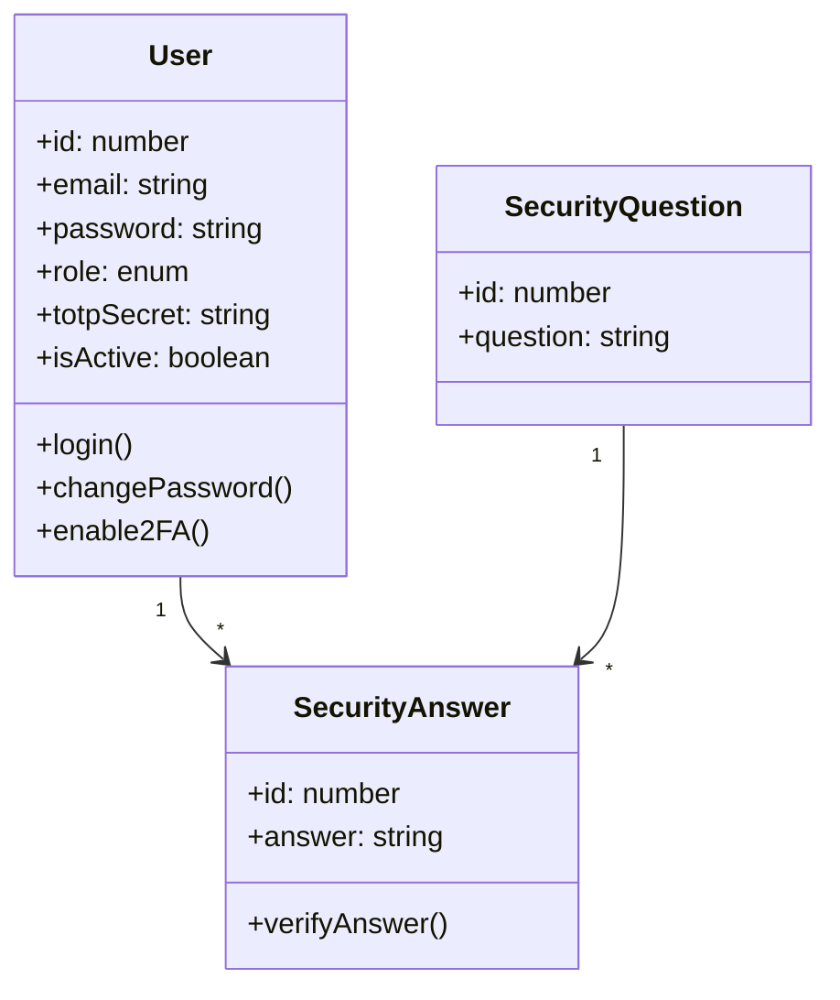
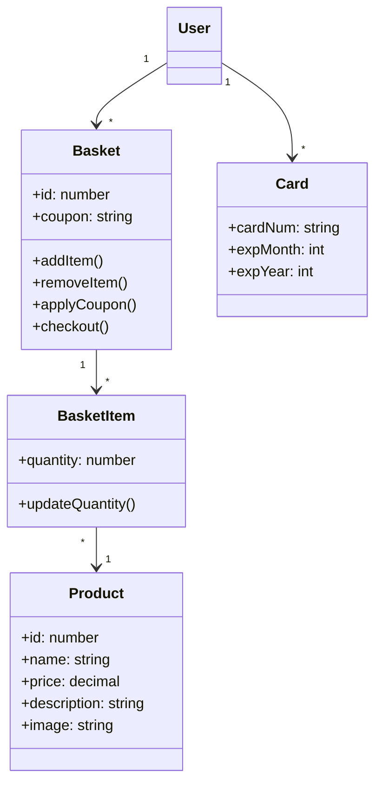
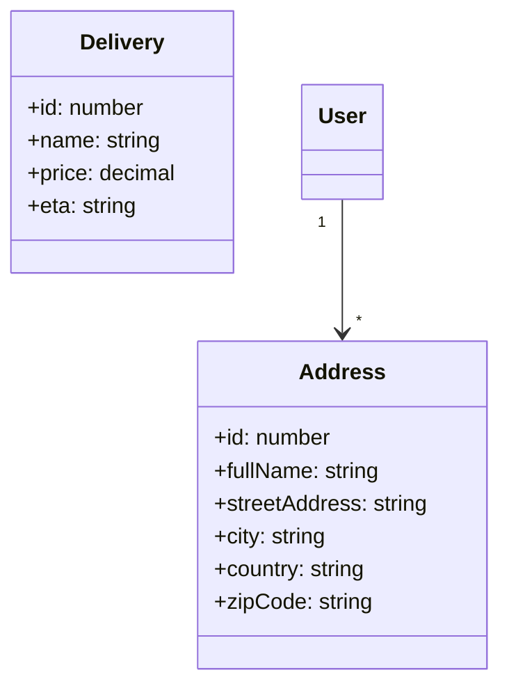
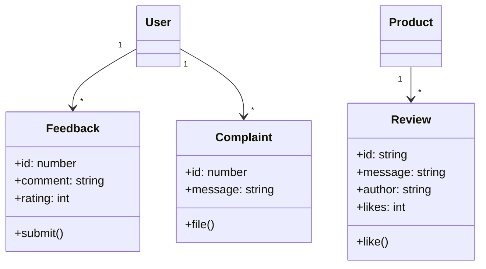
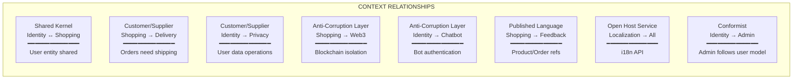
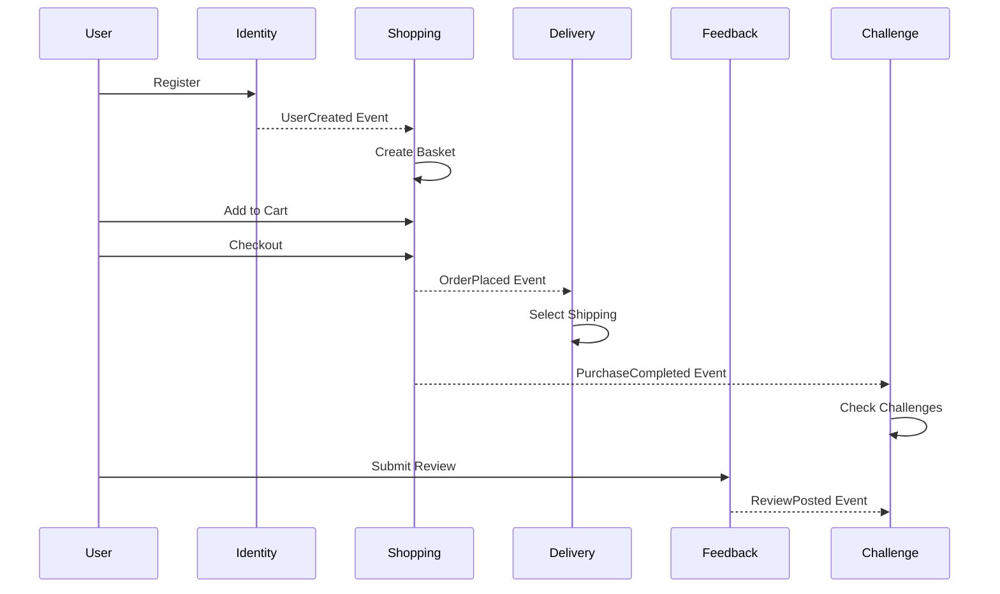
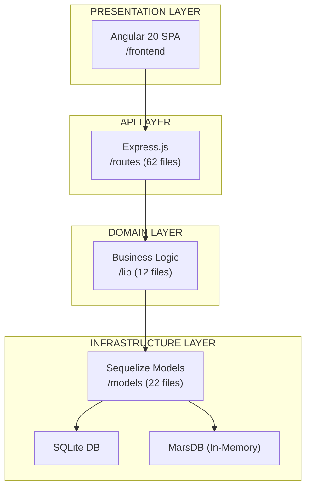

# Context Map - OWASP Juice Shop
## Domain-Driven Design Analysis

**Fecha:** 2 de Febrero, 2026
**Proyecto:** OWASP Juice Shop v19.1.1

---

## 1. Context Map Overview (MermaidJS)

---

## 2. Bounded Contexts Detailed

### 2.1 CORE DOMAIN

#### Identity Context (Gestión de Identidad)
| Aspecto | Detalle |
|---------|---------|
| **Responsabilidad** | Autenticación, autorización, gestión de usuarios |
| **Modelos** | `User`, `SecurityQuestion`, `SecurityAnswer` |
| **Rutas** | `/routes/login.ts`, `/routes/currentUser.ts`, `/routes/changePassword.ts`, `/routes/resetPassword.ts`, `/routes/2fa.ts` |
| **Agregados** | User (root), SecurityAnswer (child) |
| **Ubiquitous Language** | User, Login, Token, 2FA, Password Reset, Security Question |

#### Shopping Context (Compras)
| Aspecto | Detalle |
|---------|---------|
| **Responsabilidad** | Catálogo, carrito, órdenes, pagos |
| **Modelos** | `Product`, `Basket`, `BasketItem`, `Card`, `Quantity` |
| **Rutas** | `/routes/basket.ts`, `/routes/basketItems.ts`, `/routes/order.ts`, `/routes/payment.ts`, `/routes/coupon.ts` |
| **Agregados** | Basket (root), Product (root), Order (root) |
| **Ubiquitous Language** | Product, Basket, Order, Payment, Coupon, Checkout |

---

### 2.2 SUPPORTING DOMAINS

#### Delivery Context (Entregas)
| Aspecto | Detalle |
|---------|---------|
| **Responsabilidad** | Métodos de envío, direcciones |
| **Modelos** | `Delivery`, `Address` |
| **Rutas** | `/routes/delivery.ts`, `/routes/address.ts` |
| **Agregados** | Address (root), Delivery (root) |
| **Ubiquitous Language** | Delivery Method, Address, Shipping, ETA |

#### Feedback Context (Retroalimentación)
| Aspecto | Detalle |
|---------|---------|
| **Responsabilidad** | Reseñas, quejas, feedback |
| **Modelos** | `Feedback`, `Complaint`, `Review` (MongoDB) |
| **Rutas** | `/routes/feedback.ts`, `/routes/createProductReviews.ts`, `/routes/likeProductReviews.ts` |
| **Agregados** | Feedback (root), Complaint (root), Review (root) |
| **Ubiquitous Language** | Review, Rating, Complaint, Feedback, Like |

#### Privacy Context (Privacidad - GDPR)
| Aspecto | Detalle |
|---------|---------|
| **Responsabilidad** | Exportación de datos, derecho al olvido |
| **Modelos** | `PrivacyRequest` |
| **Rutas** | `/routes/dataExport.ts`, `/routes/dataErasure.ts` |
| **Agregados** | PrivacyRequest (root) |
| **Ubiquitous Language** | Data Export, Data Erasure, Privacy Request, GDPR |

---

### 2.3 GENERIC SUBDOMAINS

#### Challenge Context (Desafíos de Seguridad)
| Aspecto | Detalle |
|---------|---------|
| **Responsabilidad** | Gamificación, tracking de vulnerabilidades |
| **Modelos** | `Challenge`, `Hint` |
| **Rutas** | `/routes/continueCode.ts`, `/routes/repeatNotification.ts` |
| **Lib** | `/lib/challengeUtils.ts`, `/lib/codingChallenges.ts` |
| **Datos** | `/data/static/challenges.yml` (126 challenges) |

#### Administration Context (Administración)
| Aspecto | Detalle |
|---------|---------|
| **Responsabilidad** | Panel de admin, gestión de sistema |
| **Rutas** | `/routes/authenticatedUsers.ts`, `/routes/appVersion.ts`, `/routes/appConfiguration.ts` |
| **Roles** | admin, accounting |

#### Blockchain Context (Web3)
| Aspecto | Detalle |
|---------|---------|
| **Responsabilidad** | NFT minting, wallet blockchain |
| **Modelos** | `Wallet` |
| **Rutas** | `/routes/nftMint.ts`, `/routes/web3Wallet.ts` |
| **Libs** | ethers.js, web3.js |

#### Chatbot Context (Atención al Cliente)
| Aspecto | Detalle |
|---------|---------|
| **Responsabilidad** | Servicio automatizado de atención |
| **Rutas** | `/routes/chatbot.ts` |
| **Datos** | `/data/chatbot/` |
| **Lib** | juicy-chat-bot |

#### Localization Context (Internacionalización)
| Aspecto | Detalle |
|---------|---------|
| **Responsabilidad** | Traducciones, soporte multi-idioma |
| **Rutas** | `/routes/languages.ts`, `/routes/countryMapping.ts` |
| **Datos** | `/i18n/` (44 idiomas) |

---

## 3. Context Relationships

---

## 4. Aggregate Boundaries

| Bounded Context | Aggregate Root | Entities | Value Objects |
|-----------------|----------------|----------|---------------|
| Identity | User | SecurityAnswer | Email, Password, Role |
| Shopping | Basket | BasketItem | Coupon, Price |
| Shopping | Product | Quantity | ProductImage, Description |
| Shopping | Order | OrderLine | OrderId, PaymentDetails |
| Delivery | Address | - | ZipCode, Country |
| Delivery | Delivery | - | ETA, ShippingCost |
| Feedback | Review | - | Rating, Comment |
| Feedback | Complaint | - | ComplaintType |
| Privacy | PrivacyRequest | - | RequestType, RequestDate |
| Challenge | Challenge | Hint | Difficulty, Category |
| Blockchain | Wallet | - | WalletAddress, Balance |

---

## 5. Domain Events (Implicit)

---

## 6. Technical Architecture Alignment

---

## 7. Mapping to Files

| Bounded Context | Key Files |
|-----------------|-----------|
| **Identity** | `models/user.ts`, `routes/login.ts`, `routes/2fa.ts`, `lib/insecurity.ts` |
| **Shopping** | `models/basket.ts`, `models/product.ts`, `routes/basket.ts`, `routes/order.ts` |
| **Delivery** | `models/delivery.ts`, `models/address.ts`, `routes/delivery.ts`, `routes/address.ts` |
| **Feedback** | `models/feedback.ts`, `models/complaint.ts`, `routes/createProductReviews.ts` |
| **Privacy** | `models/privacyRequests.ts`, `routes/dataExport.ts`, `routes/dataErasure.ts` |
| **Challenge** | `models/challenge.ts`, `lib/challengeUtils.ts`, `data/static/challenges.yml` |
| **Admin** | `routes/appConfiguration.ts`, `routes/authenticatedUsers.ts` |
| **Blockchain** | `models/wallet.ts`, `routes/nftMint.ts`, `routes/web3Wallet.ts` |
| **Chatbot** | `routes/chatbot.ts`, `data/chatbot/` |
| **Localization** | `routes/languages.ts`, `i18n/`, `frontend/src/assets/i18n/` |

---

## 8. Conclusión

El Context Map revela que OWASP Juice Shop tiene una arquitectura de dominio bien definida con:

- **2 Core Domains:** Identity y Shopping (el negocio principal)
- **3 Supporting Domains:** Delivery, Feedback, Privacy (soporte al core)
- **5 Generic Subdomains:** Challenge, Admin, Blockchain, Chatbot, Localization

La relación más crítica es el **Shared Kernel** entre Identity y Shopping, donde el modelo `User` es compartido y debe mantenerse consistente entre ambos contextos.
