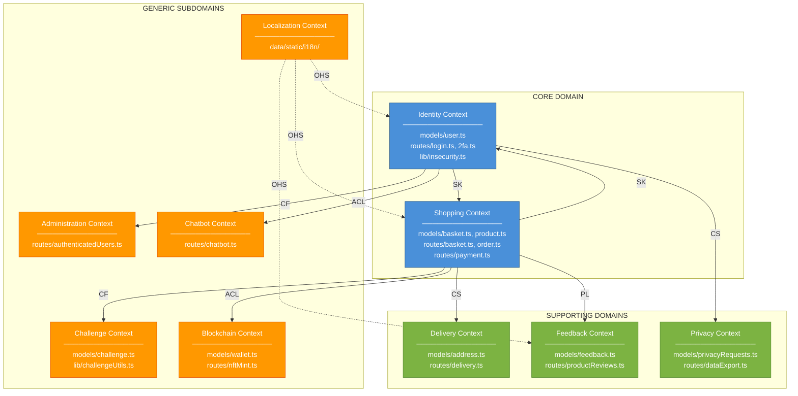
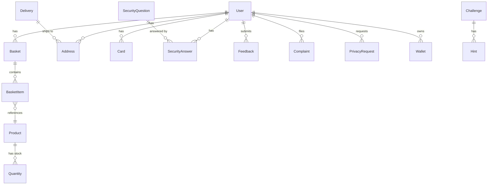
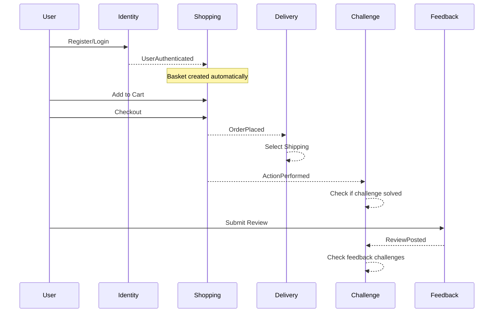

# Context Map — OWASP Juice Shop

## Domain-Driven Design Analysis

**Fecha:** 2 de Febrero, 2026
**Proyecto:** OWASP Juice Shop v19.1.1
**Metodología:** Análisis estático con Claude Code leyendo todos los archivos fuente, modelos Sequelize, rutas Express, y configuración. Todas las referencias verificadas contra código fuente.

---

## 1. Architecture Overview

OWASP Juice Shop es una aplicación e-commerce monolítica construida con Node.js + Express (backend) y Angular (frontend), usando SQLite como base de datos via Sequelize ORM.

**La estructura del proyecto sigue una organización por capa técnica:**

| Directory | Role | Files |
|-----------|------|-------|
| `models/` | Entidades de dominio (Sequelize ORM) | 20 modelos (user.ts, product.ts, basket.ts, etc.) |
| `routes/` | Endpoints API REST | 64 archivos (login.ts, order.ts, basket.ts, etc.) |
| `lib/` | Lógica de negocio compartida | 12 archivos (insecurity.ts, challengeUtils.ts, etc.) |
| `data/` | Datos estáticos y seeders | challenges.yml, users.yml, datacreator.ts |
| `frontend/src/app/` | Componentes Angular | 70+ componentes, 76 servicios |
| `config/` | Configuración por entorno | 15 archivos YAML |

---

## 2. Bounded Contexts

### 2.1 Identity Context (Gestión de Identidad)

| Aspect | Detail |
|--------|--------|
| **Package** | `routes/login.ts`, `routes/2fa.ts`, `routes/register.ts` |
| **Aggregate Root** | `User` |
| **Entities** | `User`, `SecurityQuestion`, `SecurityAnswer` |
| **Tables** | `Users`, `SecurityQuestions`, `SecurityAnswers` |
| **Endpoints** | 8 endpoints via login.ts, 2fa.ts, changePassword.ts, resetPassword.ts |

**Responsabilidades:**
- Autenticación (login, logout, OAuth)
- Autorización (roles: admin, customer, accounting, deluxe)
- Gestión de contraseñas (cambio, reset via security question)
- Two-Factor Authentication (TOTP)

### 2.2 Shopping Context (Compras)

| Aspect | Detail |
|--------|--------|
| **Package** | `routes/basket.ts`, `routes/order.ts`, `routes/payment.ts` |
| **Aggregate Root** | `Basket`, `Product` |
| **Entities** | `Basket`, `BasketItem`, `Product`, `Quantity`, `Card` |
| **Tables** | `Baskets`, `BasketItems`, `Products`, `Quantities`, `Cards` |
| **Endpoints** | 15+ endpoints via basket.ts, basketItems.ts, order.ts, payment.ts, coupon.ts |

**Responsabilidades:**
- Catálogo de productos y búsqueda
- Carrito de compras (agregar, modificar, eliminar)
- Proceso de checkout y generación de órdenes
- Gestión de métodos de pago
- Aplicación de cupones de descuento

### 2.3 Delivery Context (Entregas)

| Aspect | Detail |
|--------|--------|
| **Package** | `routes/delivery.ts`, `routes/address.ts` |
| **Aggregate Root** | `Address`, `Delivery` |
| **Entities** | `Address`, `Delivery` |
| **Tables** | `Addresses`, `Deliveries` |
| **Endpoints** | 6 endpoints via delivery.ts, address.ts |

**Responsabilidades:**
- Gestión de direcciones de envío (CRUD)
- Métodos de envío (Standard, Fast, One Day)
- Cálculo de costos y tiempos de entrega

### 2.4 Feedback Context (Retroalimentación)

| Aspect | Detail |
|--------|--------|
| **Package** | `routes/feedback.ts`, `routes/createProductReviews.ts` |
| **Aggregate Root** | `Feedback`, `Complaint`, `Review` |
| **Entities** | `Feedback`, `Complaint`, `Review` (MarsDB) |
| **Tables** | `Feedbacks`, `Complaints`, `reviews` (in-memory MongoDB) |
| **Endpoints** | 6 endpoints via feedback.ts, complaint.ts, productReviews.ts |

**Responsabilidades:**
- Reseñas de productos (crear, ver, dar like)
- Feedback general de la tienda
- Sistema de quejas/reclamos con adjuntos

### 2.5 Privacy Context (Privacidad - GDPR)

| Aspect | Detail |
|--------|--------|
| **Package** | `routes/dataExport.ts`, `routes/dataErasure.ts` |
| **Aggregate Root** | `PrivacyRequest` |
| **Entities** | `PrivacyRequest` |
| **Tables** | `PrivacyRequests` |
| **Endpoints** | 3 endpoints via dataExport.ts, dataErasure.ts |

**Responsabilidades:**
- Exportación de datos personales (GDPR Art. 20)
- Solicitud de borrado de datos (GDPR Art. 17)
- Tracking de solicitudes de privacidad

### 2.6 Challenge Context (Gamificación)

| Aspect | Detail |
|--------|--------|
| **Package** | `lib/challengeUtils.ts`, `routes/verify.ts` |
| **Aggregate Root** | `Challenge` |
| **Entities** | `Challenge`, `Hint` |
| **Tables** | `Challenges`, `Hints` |
| **Data** | `data/static/challenges.yml` (126 challenges) |
| **Endpoints** | 5 endpoints via continueCode.ts, vulnCodeSnippet.ts |

**Responsabilidades:**
- Definición y tracking de 126 security challenges
- Sistema de hints multinivel
- Verificación automática de soluciones (verify.ts - 440 líneas)
- Coding challenges (find it / fix it)

### 2.7 Administration Context (Administración)

| Aspect | Detail |
|--------|--------|
| **Package** | `routes/authenticatedUsers.ts`, `routes/appConfiguration.ts` |
| **Aggregate Root** | N/A (opera sobre User) |
| **Entities** | Usa entidades de Identity |
| **Roles Required** | `admin`, `accounting` |
| **Endpoints** | 4 endpoints via authenticatedUsers.ts, appVersion.ts |

**Responsabilidades:**
- Panel de administración de usuarios
- Visualización de feedback
- Configuración del sistema
- Módulo de contabilidad

### 2.8 Blockchain Context (Web3)

| Aspect | Detail |
|--------|--------|
| **Package** | `routes/nftMint.ts`, `routes/web3Wallet.ts` |
| **Aggregate Root** | `Wallet` |
| **Entities** | `Wallet` |
| **Tables** | `Wallets` |
| **Libraries** | ethers.js, web3.js |
| **Endpoints** | 4 endpoints via nftMint.ts, web3Wallet.ts |

**Responsabilidades:**
- Wallet de criptomonedas
- Minting de NFTs
- Integración con smart contracts

### 2.9 Chatbot Context (Atención al Cliente)

| Aspect | Detail |
|--------|--------|
| **Package** | `routes/chatbot.ts` (247 líneas) |
| **Aggregate Root** | N/A (stateless) |
| **Data** | `data/chatbot/` training data |
| **Library** | juicy-chat-bot |
| **Endpoints** | 2 endpoints via chatbot.ts |

**Responsabilidades:**
- Servicio automatizado de atención
- Respuestas basadas en NLP
- Integración con sistema de cupones

### 2.10 Localization Context (Internacionalización)

| Aspect | Detail |
|--------|--------|
| **Package** | `routes/languages.ts`, `i18n/` |
| **Data** | 44 archivos de traducción en `data/static/i18n/` |
| **Endpoints** | 2 endpoints via languages.ts, countryMapping.ts |

**Responsabilidades:**
- Soporte para 44 idiomas
- Mapeo de países
- Servicio de traducciones

---

## 3. Context Map Diagram

### 3.1 High-Level Context Map

### 3.2 DDD Relationship Types

| Abbreviation | Pattern | Description |
|--------------|---------|-------------|
| **SK (Shared Kernel)** | Identity ↔ Shopping | El modelo `User` es compartido entre ambos contextos. Cambios requieren coordinación. |
| **CF (Conformist)** | Admin → Identity | Administration se conforma al modelo de User sin poder modificarlo. |
| **CS (Customer-Supplier)** | Shopping → Delivery | Shopping (customer) solicita servicios de Delivery (supplier) para envíos. |
| **PL (Published Language)** | Shopping → Feedback | Reviews referencian Products usando IDs como lenguaje común. |
| **ACL (Anti-Corruption Layer)** | Shopping → Blockchain | Capa de traducción aísla la complejidad de Web3 del dominio core. |
| **OHS (Open Host Service)** | Localization → All | API de traducciones disponible para todos los contextos. |

---

## 4. Entity Relationship Diagram

---

## 5. Aggregate Boundaries

| Bounded Context | Aggregate Root | Child Entities | Value Objects |
|-----------------|----------------|----------------|---------------|
| **Identity** | User | SecurityAnswer | Email, Password, Role, TotpSecret |
| **Shopping** | Basket | BasketItem | Coupon |
| **Shopping** | Product | Quantity | Price, Description, Image |
| **Shopping** | Card | - | CardNumber, ExpiryDate |
| **Delivery** | Address | - | ZipCode, Country, City |
| **Delivery** | Delivery | - | Price, ETA, Name |
| **Feedback** | Feedback | - | Rating, Comment |
| **Feedback** | Complaint | - | Message, File |
| **Privacy** | PrivacyRequest | - | RequestType, Status |
| **Challenge** | Challenge | Hint | Difficulty, Category, Key |
| **Blockchain** | Wallet | - | Balance, Address |

---

## 6. Domain Events (Implicit in Code)

El código no implementa eventos de dominio explícitos, pero estos flujos están implícitos:

---

## 7. File-to-Context Mapping

### Identity Context
| File | Purpose |
|------|---------|
| `models/user.ts` | User entity (4206 lines) |
| `models/securityQuestion.ts` | Security questions |
| `models/securityAnswer.ts` | User's security answers |
| `routes/login.ts` | Authentication endpoint |
| `routes/2fa.ts` | Two-factor auth (176 lines) |
| `routes/changePassword.ts` | Password change |
| `routes/resetPassword.ts` | Password reset via security Q |
| `lib/insecurity.ts` | JWT, auth utilities (7963 lines) |

### Shopping Context
| File | Purpose |
|------|---------|
| `models/product.ts` | Product catalog |
| `models/basket.ts` | Shopping cart |
| `models/basketitem.ts` | Cart line items |
| `models/card.ts` | Payment cards |
| `models/quantity.ts` | Inventory |
| `routes/basket.ts` | Cart operations |
| `routes/basketItems.ts` | Cart item CRUD |
| `routes/order.ts` | Checkout (208 lines) |
| `routes/payment.ts` | Payment processing |
| `routes/coupon.ts` | Discount codes |
| `routes/search.ts` | Product search |

### Delivery Context
| File | Purpose |
|------|---------|
| `models/address.ts` | Shipping addresses |
| `models/delivery.ts` | Delivery methods |
| `routes/address.ts` | Address CRUD |
| `routes/delivery.ts` | Delivery options |

### Feedback Context
| File | Purpose |
|------|---------|
| `models/feedback.ts` | General feedback |
| `models/complaint.ts` | Customer complaints |
| `routes/createProductReviews.ts` | Create reviews |
| `routes/showProductReviews.ts` | Read reviews |
| `routes/likeProductReviews.ts` | Like reviews |

### Privacy Context
| File | Purpose |
|------|---------|
| `models/privacyRequests.ts` | GDPR requests |
| `routes/dataExport.ts` | Export user data |
| `routes/dataErasure.ts` | Delete user data |

### Challenge Context
| File | Purpose |
|------|---------|
| `models/challenge.ts` | Challenge definitions |
| `models/hint.ts` | Challenge hints |
| `lib/challengeUtils.ts` | Challenge helpers |
| `lib/codingChallenges.ts` | Code fix evaluation |
| `routes/verify.ts` | Solution verification (440 lines) |
| `routes/continueCode.ts` | Progress persistence |
| `data/static/challenges.yml` | 126 challenge definitions |

---

## 8. Summary

### Context Count by Type

| Type | Count | Contexts |
|------|-------|----------|
| **Core Domain** | 2 | Identity, Shopping |
| **Supporting Domain** | 3 | Delivery, Feedback, Privacy |
| **Generic Subdomain** | 5 | Challenge, Admin, Blockchain, Chatbot, Localization |
| **Total** | **10** | |

### Critical Relationship

La relación más importante es el **Shared Kernel** entre Identity y Shopping:

- El modelo `User` es referenciado por `Basket`, `Card`, `Address`, `Feedback`, `Wallet`
- Cualquier cambio en User requiere validar impacto en múltiples contextos
- La tabla `Users` tiene 4206 líneas de código, la más compleja del sistema

### Recomendación Arquitectural

Para evolucionar hacia microservicios, los candidatos naturales serían:
1. **Challenge Context** - ya está aislado, no tiene dependencias hacia User
2. **Localization Context** - stateless, puede ser servicio independiente
3. **Chatbot Context** - stateless, integración simple via API

---

*Generated 2026-02-10 via AI-driven static analysis (Claude Code) of all source files, Sequelize models, Express routes, and configuration.*
