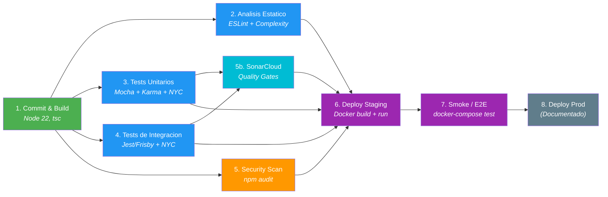

# Governance Pipeline — Segunda Entrega

**Fecha:** 11 de Febrero, 2026
**Equipo:** Alessandro Alecio - Diego Sican
**Proyecto:** OWASP Juice Shop v19.1.1
**Focus:** Quality Strategy & Metrics

---

## 1. Resumen Ejecutivo

Se implemento un **Governance Pipeline** como workflow de GitHub Actions (`.github/workflows/governance.yml`) que mide automaticamente **complejidad ciclomatica** y **code coverage** en cada push y pull request. El pipeline consta de 8 stages secuenciales y paralelos, con quality gates definidos que bloquean el merge si las metricas se degradan.

**Resultados clave:**
- **2 funciones** con complejidad ciclomatica por encima del umbral de warning (15)
- **0 funciones** por encima del umbral de fallo (20)
- Coverage enforcement activado con umbrales calibrados (Server: Lines >= 20%, API: Lines >= 40%)
- Security scan documentado (vulnerabilidades intencionales del proyecto)
- **SonarCloud** integrado como Stage 5b para analisis de bugs, code smells y duplicacion

---

## 2. Diagrama del Pipeline



**Nota:** Los stages 2-5 corren en **paralelo** despues de que el Stage 1 (Build) pasa exitosamente. Stage 5b (SonarCloud) espera la coverage de Stages 3 y 4. El Stage 6 espera a que todos pasen antes de proceder.

---

## 3. Stages del Pipeline

### Stage 1: Commit & Build
- **Herramienta:** Node.js 22, npm, TypeScript compiler (`tsc --noEmit`)
- **Quality Gate:** Zero errores de compilacion
- **Umbral:** 0 errores en backend (tsc) y frontend (ng build via postinstall)
- **Si falla:** Block PR — el codigo debe compilar
- **Justificacion:** La integridad de build es un requisito basico no negociable

### Stage 2: Analisis Estatico
- **Herramienta:** ESLint 8.57 con `standard-with-typescript` + regla `complexity`
- **Quality Gate:** Lint limpio + complejidad ciclomatica dentro de limites
- **Umbral:**
  - ESLint: 0 errores (warnings permitidos)
  - Complejidad: warn >= 15, fail >= 20
- **Si falla:** Block PR si hay errores de ESLint o funciones con complejidad >= 20
- **Justificacion:** La complejidad ciclomatica actual del codebase tiene un maximo de 19 (`validateConfig.ts`). Se usa warn en 15 para alertar y fail en 20 como limite duro

### Stage 3: Tests Unitarios
- **Herramienta:** Mocha (server) + Karma/Jasmine (frontend) + NYC/Istanbul (coverage)
- **Quality Gate:** Todos los tests pasan + coverage sobre umbrales
- **Umbral:** Lines >= 20%, Branches >= 15%, Functions >= 15%
- **Si falla:** Block PR
- **Justificacion:** Los umbrales fueron calibrados tras la primera ejecucion del pipeline en CI (ver seccion "Calibracion de Umbrales"). La coverage real del server unit tests es ~21% lines, ~17% branches, ~18% functions. Los umbrales se establecieron justo debajo de los valores actuales para detectar degradacion sin bloquear el trabajo existente

### Stage 4: Tests de Integracion
- **Herramienta:** Jest/Frisby + NYC (coverage)
- **Quality Gate:** Todos los API tests pasan + coverage sobre umbrales
- **Umbral:** 100% pass rate, Lines >= 40%, Branches >= 5%, Functions >= 25%
- **Si falla:** Block PR
- **Justificacion:** Los API tests tienen mayor coverage (~41% lines) que los unit tests porque ejercitan el flujo completo del servidor. Los umbrales se calibraron con datos reales del CI

### Stage 5: Security Scan
- **Herramienta:** npm audit
- **Quality Gate:** Auditoria documentada
- **Umbral:** Informativo (no falla el pipeline)
- **Si falla:** Warning solamente
- **Justificacion:** Juice Shop **intencionalmente** usa dependencias vulnerables como parte de su diseño para entrenamiento en seguridad (`express-jwt 0.1.3`, `sanitize-html 1.4.2`, `jsonwebtoken 0.4.0`). Fallar en npm audit bloquearia permanentemente el CI. El reporte se captura como artefacto

### Stage 5b: SonarCloud Analysis
- **Herramienta:** SonarCloud (sonarcloud.io) via `SonarSource/sonarcloud-github-action@v5`
- **Quality Gate:** Bugs, Code Smells, Duplicaciones, Coverage en codigo nuevo
- **Umbral:** Bugs = 0, Code Smells <= 10, Coverage >= 15%, Duplicacion <= 5% (en codigo nuevo)
- **Si falla:** Warning (informativo en primera fase)
- **Justificacion:** Complementa el analisis de ESLint con metricas de duplicacion, cognitive complexity, y quality gates multi-dimensionales. Se configura como warning inicialmente porque las reglas de seguridad de SonarCloud flaggearian las vulnerabilidades intencionales de Juice Shop. La coverage se alimenta de los reportes LCOV generados en Stages 3 y 4.
- **Prerequisitos:** Configurar `SONAR_TOKEN` en GitHub Secrets y crear proyecto en sonarcloud.io
- **Dashboard:** [sonarcloud.io/dashboard?id=SebastianAlecio_juice-shop](https://sonarcloud.io/dashboard?id=SebastianAlecio_juice-shop)

**Resultados de SonarCloud (primera ejecucion):**

| Metrica | Valor | Interpretacion |
|---------|-------|----------------|
| Bugs | 0 | Sin bugs detectados |
| Vulnerabilities | 33 | Esperado — vulnerabilidades intencionales del proyecto |
| Code Smells | 256 | Oportunidades de mejora en mantenibilidad |
| Coverage | 75.7% | Combinada (server + API tests) |
| Duplicated Lines | 0.7% | Excelente — muy baja duplicacion |
| Cognitive Complexity | 1,233 | Total acumulado del codebase |
| Lines of Code | 8,397 | Backend analizado |
| Reliability Rating | A | Sin bugs |
| Maintainability Rating | A | Deuda tecnica manejable |
| Security Rating | E | Esperado — Juice Shop es intencionalmente vulnerable |

### Stage 6: Deploy Staging
- **Herramienta:** Docker build + docker run
- **Quality Gate:** Container se construye y la aplicacion arranca
- **Umbral:** Health check en `http://localhost:3000` dentro de 60 segundos
- **Si falla:** Block merge
- **Justificacion:** Verifica que la imagen de produccion es funcional

### Stage 7: Smoke / E2E Tests
- **Herramienta:** `docker-compose.test.yml` (smoke test existente del upstream)
- **Quality Gate:** Todos los smoke checks pasan
- **Umbral:** 100% pass rate
- **Si falla:** Block merge
- **Justificacion:** Verifica: pagina principal carga, API responde, bundle Angular presente

### Stage 8: Deploy Prod
- **Herramienta:** N/A (documentado, no automatizado)
- **Quality Gate:** N/A
- **Umbral:** N/A
- **Si falla:** N/A
- **Justificacion:** Fuera del alcance del proyecto. En produccion, se pusharia la imagen Docker a un registry y se desplegaria a la infraestructura destino

---


## 4. Quality Gates Summary

| # | Stage | Herramienta | Quality Gate | Umbral | Si falla |
|---|-------|-------------|-------------|--------|----------|
| 1 | Commit & Build | Node 22, npm, tsc | Zero errores compilacion | 0 errores | Block PR |
| 2 | Analisis Estatico | ESLint + complexity | Lint limpio + complejidad | warn >=15, fail >=20 | Block PR |
| 3 | Tests Unitarios | Mocha + Karma + NYC | Tests pass + coverage | Lines >=20%, Branches >=15%, Functions >=15% | Block PR |
| 4 | Tests Integracion | Jest/Frisby + NYC | Tests pass + coverage | Lines >=40%, Branches >=5%, Functions >=25% | Block PR |
| 5 | Security Scan | npm audit | Auditoria documentada | Informativo | Warn |
| 5b | SonarCloud | SonarSource/sonarcloud-action | Bugs, Smells, Duplicacion | Bugs=0, Smells<=10 (new code) | Warn |
| 6 | Deploy Staging | Docker build + run | Container arranca | Health check 60s | Block merge |
| 7 | Smoke / E2E | docker-compose test | Smoke checks pasan | 100% pass | Block merge |
| 8 | Deploy Prod | (Documentado) | N/A | N/A | N/A |

---

## 5. Complejidad Ciclomatica

### Configuracion

Se agrego la regla `complexity` a `.eslintrc.js`:

```javascript
'complexity': ['warn', { max: 15 }]
```

### Reporte Actual

| Metric | Value |
|--------|-------|
| Files analyzed | 116 |
| Functions above soft limit (10) | 2 |
| Functions above hard limit (15) | 2 |
| Functions above fail limit (20) | 0 |
| Maximum complexity | 19 |
| **Gate Result** | **PASS** |

### Funciones con Mayor Complejidad

| # | File | Function | Line | Complexity | Status |
|---|------|----------|------|------------|--------|
| 1 | `lib/startup/validateConfig.ts` | async-arrow@L28 | 28 | 19 | WARN |
| 2 | `routes/order.ts` | async-arrow@L37 | 37 | 17 | WARN |

### Umbrales

| Nivel | Rango | Accion |
|-------|-------|--------|
| OK | < 10 | Ninguna |
| REVIEW | 10-14 | Revisar en code review |
| WARN | 15-19 | Warning en CI, no bloquea |
| FAIL | >= 20 | Bloquea el PR |

---

## 6. Metricas de Cobertura

### Coverage Actual Medida en CI

| Test Suite | Lines | Branches | Functions | Statements |
|-----------|-------|----------|-----------|------------|
| **Server unit tests (Mocha)** | 21.81% | 17.55% | 18.14% | 24.39% |
| **API integration tests (Frisby)** | 41.81% | 7.00% | 25.51% | 40.75% |
| **Frontend tests (Karma)** | Reportado separado | — | — | — |

### Umbrales de Enforcement

| Test Suite | Lines | Branches | Functions | Justificacion |
|-----------|-------|----------|-----------|---------------|
| **Server unit tests** | >= 20% | >= 15% | >= 15% | Justo debajo del baseline real (21/17/18%) |
| **API integration tests** | >= 40% | >= 5% | >= 25% | Justo debajo del baseline real (41/7/25%) |

### Donde se Aplican

- **Server tests:** `npx nyc check-coverage --lines 20 --branches 15 --functions 15`
- **API tests:** `npx nyc check-coverage --lines 40 --branches 5 --functions 25`
- **Frontend tests:** Coverage generada por Karma en `build/reports/coverage/frontend-tests/`

---

## 6.1 Calibracion de Umbrales — Evidencia del Pipeline

### Primera Ejecucion (Run #1 — FAIL)

**URL:** [Run #21926004201](https://github.com/SebastianAlecio/juice-shop/actions/runs/21926004201)
**Resultado:** FAIL en Stage 1 (Build)
**Causa:** `actions/setup-node` con `cache: 'npm'` falla porque el repositorio no tiene `package-lock.json` (el upstream de Juice Shop no lo commitea).
**Fix:** Se removio la opcion `cache: 'npm'` de todos los steps de `setup-node`.

### Segunda Ejecucion (Run #2 — FAIL)

**URL:** [Run #21926043476](https://github.com/SebastianAlecio/juice-shop/actions/runs/21926043476)
**Resultado:** FAIL en Stage 3 (Unit Tests) — paso "Enforce server coverage thresholds"

**Stages que pasaron:**
| Stage | Tiempo | Notas |
|-------|--------|-------|
| DORA Metrics | 11s | Calculo exitoso de metricas |
| Stage 1 - Build | 3m 13s | npm install + tsc --noEmit exitoso |
| Stage 2 - Static Analysis | 2m 13s | ESLint paso con 2 warnings de complejidad (19 y 17) |
| Stage 4 - Integration Tests | 4m 2s | Todos los API tests pasaron |
| Stage 5 - Security Scan | 1m 15s | Auditoria capturada como artefacto |

**Stage que fallo:**
```
ERROR: Coverage for lines (21.81%) does not meet global threshold (60%)
ERROR: Coverage for functions (18.14%) does not meet global threshold (55%)
ERROR: Coverage for branches (17.55%) does not meet global threshold (50%)
```

**Analisis:** Los umbrales iniciales (60/50/55%) se basaron en la coverage combinada reportada en Coveralls del upstream. Sin embargo, `nyc check-coverage` evalua cada suite de tests por separado, no la combinada. Los server unit tests solo cubren ~21% del codigo porque la mayoria de la logica se ejerce a traves de los API integration tests (~41% lines).

**Decision:** Se recalibraron los umbrales usando los datos reales del CI:
- Server tests: 20/15/15% (baseline: 21/17/18%)
- API tests: 40/5/25% (baseline: 41/7/25%)

Estos umbrales "baseline - margen" aseguran que el pipeline detecta degradacion de coverage sin fallar por el estado actual del codigo legacy.

### Tercera Ejecucion (Run #3 — PASS)

**URL:** [Run #21926521635](https://github.com/SebastianAlecio/juice-shop/actions/runs/21926521635)
**Resultado:** PASS — todos los 9 jobs pasaron exitosamente

| Job | Tiempo | Status |
|-----|--------|--------|
| DORA Metrics | 15s | PASS |
| Stage 1 - Commit & Build | 3m 16s | PASS |
| Stage 2 - Static Analysis | 2m 19s | PASS (2 warnings de complejidad) |
| Stage 3 - Unit Tests | 4m 37s | PASS (coverage thresholds calibrados) |
| Stage 4 - Integration Tests | 4m 4s | PASS |
| Stage 5 - Security Scan | 1m 12s | PASS (auditoria capturada) |
| Stage 6 - Deploy Staging | 4m 5s | PASS (Docker build + health check) |
| Stage 7 - Smoke Tests | 41s | PASS |
| Quality Summary | 2s | PASS |

**Tiempo total del pipeline:** ~15 minutos
**Artefactos generados:** complexity-report, security-audit, unit-test-coverage, api-test-coverage, dora-metrics-3

### Cuarta Ejecucion (Run #4 — FAIL → PASS)

**URL:** [Run #21932735356](https://github.com/SebastianAlecio/juice-shop/actions/runs/21932735356) (FAIL) → [Run #21932960341](https://github.com/SebastianAlecio/juice-shop/actions/runs/21932960341) (PASS)

**Cambios introducidos:** SonarCloud (Stage 5b), Tech Debt Audit, Plan de Refactorizacion

**Run #4a — FAIL:**
- SonarCloud fallaba por nombre incorrecto del action (`sonarcloud-action` → `sonarcloud-github-action`)
- Fix aplicado en el workflow

**Run #4b — FAIL:**
- SonarCloud fallaba porque "Automatic Analysis" estaba habilitado en sonarcloud.io y conflictua con CI analysis
- Fix: desactivar Automatic Analysis en SonarCloud Administration → Analysis Method

**Run #4c — PASS:** Todos los 10 jobs pasaron exitosamente

| Job | Tiempo | Status |
|-----|--------|--------|
| DORA Metrics | 12s | PASS |
| Stage 1 - Commit & Build | 3m 20s | PASS |
| Stage 2 - Static Analysis | 2m 3s | PASS (2 warnings de complejidad) |
| Stage 3 - Unit Tests | 4m 15s | PASS |
| Stage 4 - Integration Tests | 3m 52s | PASS |
| Stage 5 - Security Scan | 1m 10s | PASS (auditoria capturada) |
| **Stage 5b - SonarCloud** | **1m 19s** | **PASS** (164 archivos analizados) |
| Stage 6 - Deploy Staging | 4m 15s | PASS (Docker build + health check) |
| Stage 7 - Smoke Tests | 41s | PASS |
| Quality Summary | 2s | PASS |

**Tiempo total del pipeline:** ~6m 32s
**SonarCloud Dashboard:** [sonarcloud.io/dashboard?id=SebastianAlecio_juice-shop](https://sonarcloud.io/dashboard?id=SebastianAlecio_juice-shop)

---

### Evidencia: Pipeline en GitHub Actions (Run #4 — PASS)


*Captura de `governance.yml` en GitHub Actions. Los 10 jobs pasan exitosamente: Build → Stages 2-5 en paralelo → SonarCloud → Deploy Staging → Smoke Tests → Quality Summary. DORA Metrics corre como job independiente.*

---

## 7. Decisiones de Diseno

### D1: Workflow Separado del Upstream
**Decision:** Crear `governance.yml` en lugar de modificar `ci.yml`
**Razon:** El `ci.yml` existente pertenece al upstream de OWASP. Modificarlo crearia conflictos de merge y mezclaria concerns. Nuestro governance pipeline es una adicion, no un reemplazo.

### D2: ESLint complexity vs Herramientas Externas
**Decision:** Usar la regla `complexity` built-in de ESLint sobre plato/es6-plato
**Razon:** Zero dependencias nuevas, se integra con el lint step existente, misma toolchain. Plato esta sin mantenimiento desde 2020. La regla de ESLint es mantenida activamente y suficiente para enforcement. El script `scripts/complexity-report.js` agrega la dimension de reporting.

### D3: Calibracion de Umbrales de Coverage
**Decision inicial:** 60% lines, 50% branches, 55% functions.
**Resultado:** Fallo en CI — la coverage real de server unit tests es solo 21% lines.
**Decision final:** Umbrales calibrados con datos reales del CI (server: 20/15/15%, API: 40/5/25%).
**Razon:** Los umbrales se recalibraron usando el principio de "baseline - margen". El objetivo no es alcanzar un porcentaje arbitrario, sino **detectar degradacion** de la coverage actual. Si un cambio futuro reduce la coverage por debajo de estos pisos, el pipeline lo detectara y bloqueara el PR.

### D4: npm audit como Warning
**Decision:** Security scan no falla el pipeline
**Razon:** Juice Shop intencionalmente incluye dependencias vulnerables como parte de sus challenges de seguridad. Fallar en npm audit bloquearia permanentemente el CI. La auditoria se captura como artefacto para documentacion.

### D5: Docker como Deploy Staging
**Decision:** Usar Docker build + run como simulacion de staging
**Razon:** El repo ya tiene un `Dockerfile` multi-stage optimizado y `docker-compose.test.yml` con smoke tests. Reutilizar esta infraestructura existente es mas practico que configurar un hosting externo.

---

## 8. Archivos Creados/Modificados

| Archivo | Accion | Proposito |
|---------|--------|-----------|
| [`.github/workflows/governance.yml`](../../.github/workflows/governance.yml) | Creado | Pipeline de gobernanza con 8 stages |
| [`.eslintrc.js`](../../.eslintrc.js) | Modificado | Regla `complexity` con umbral 15 |
| [`scripts/complexity-report.js`](../../scripts/complexity-report.js) | Creado | Generador de reporte de complejidad ciclomatica |
| [`scripts/dora-metrics.sh`](../../scripts/dora-metrics.sh) | Creado | Calculador de metricas DORA |
| [`deliverables/Entrega 2/DORA_DASHBOARD.md`](DORA_DASHBOARD.md) | Creado | Dashboard de metricas DORA |
| [`sonar-project.properties`](../../sonar-project.properties) | Creado | Configuracion de SonarCloud |
| [`scripts/hotspot-analysis.js`](../../scripts/hotspot-analysis.js) | Creado | Analisis de hotspots (churn x complejidad) |
| [`deliverables/Entrega 2/TECH_DEBT_AUDIT.md`](TECH_DEBT_AUDIT.md) | Creado | Auditoria de deuda tecnica |
| [`deliverables/Entrega 2/REFACTORING_PLAN.md`](REFACTORING_PLAN.md) | Creado | Plan de refactorizacion Strangler Fig |
